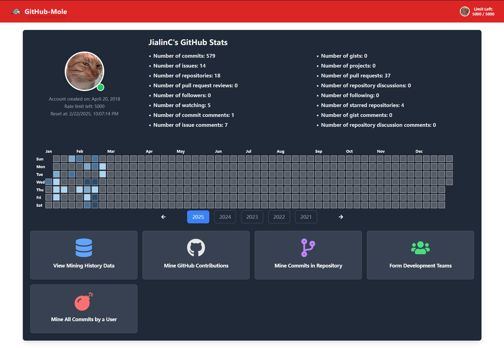
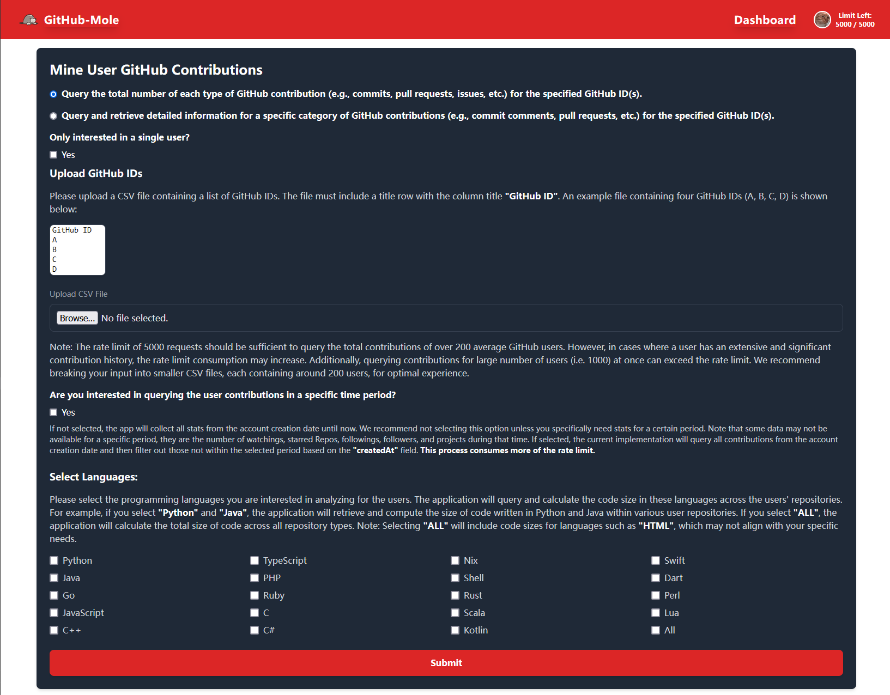
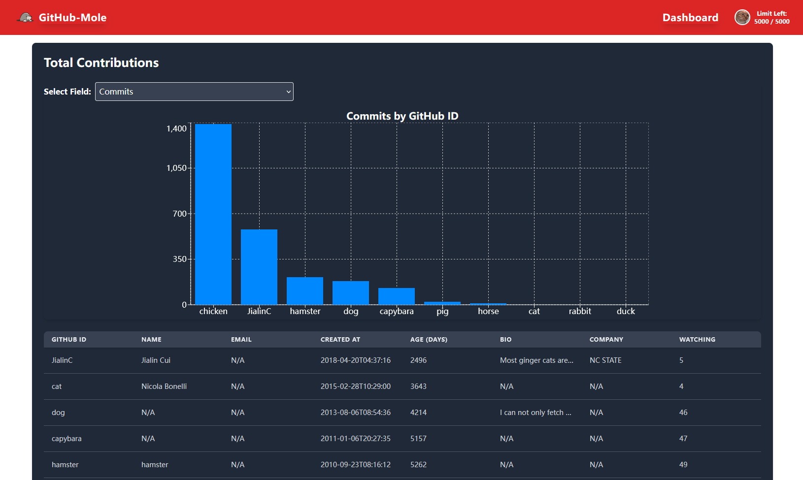
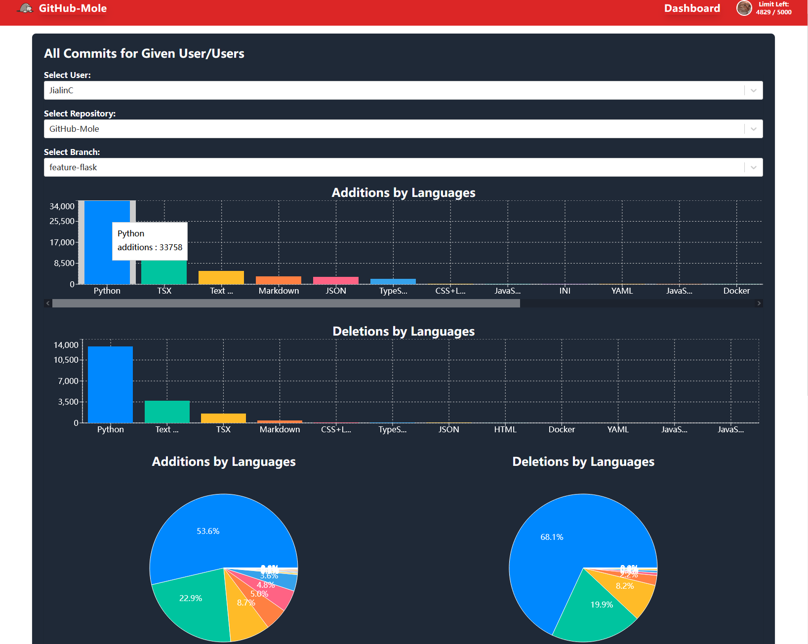

# GitHub-Mole

GitHub-Mole is an open-source software designed to automate the large-scale extraction of GitHub users' contribution data, eliminating the need for manual inspection of individual profiles. Additionally, it facilitates the formation of software development teams using a research-backed algorithm.

## 🚀 Quick Installation

GitHub-Mole can be easily deployed locally using the provided docker-compose.yml and Dockerfile. The only prerequisite is that Docker is installed on your system.

### Step 1: Clone the Repository

```sh
git clone https://github.com/JialinC/GitHub-Mole.git
cd GitHub-Mole
```

### Step 2: Set Up GitHub Authentication

When you use GitHub-Mole you can log in using your GitHub Personal Access Token (PAT) without additional configuration. If you prefer this skip to Step 3. However, if you prefer to use GitHub SSO to log in to GitHub-Mole, you will need to create an OAuth app under GitHub Developer Settings and provide the Client ID and Client Secret in your docker-compose.yml file:

```yaml
environment:
  GITHUB_OAUTH_CLIENT_ID: "YOUR_CLIENT_ID"
  GITHUB_OAUTH_CLIENT_SECRET: "YOUR_CLIENT_SECRET"
  GITHUB_HOSTNAME: "https://github.com"
  GITHUB_API_URL: "https://api.github.com"
```

Using GitHub Enterprise

If you are using public GitHub (github.com), you can keep GITHUB_HOSTNAME and GITHUB_API_URL unchanged. However, if you are using GitHub Enterprise, such as a self-hosted university GitHub instance, you must update these values accordingly.

Example (North Carolina State University GitHub):

```yaml
GITHUB_HOSTNAME: "https://github.ncsu.edu"
GITHUB_API_URL: "https://api.github.ncsu.edu"
```

### Step 3: Start the Application

Run the following command to build and launch the application:

```sh
docker-compose up --build
```

Once the setup is complete, open your browser and navigate to:

[http://localhost:3000](http://localhost:3000)

You should now be able to explore GitHub-Mole!

### 🛠 MacOS Users (M-Series Chips) – Additional Step

🚨 Mac users (M1/M2/M3 chips) may encounter an installation issue due to a dependency that cannot be installed automatically. Until February 2025, you need to manually add the following step in the backend Dockerfile:

Fix for Mac Users

Open the Dockerfile inside the backend directory.
Add the following lines under the RUN section:

```yaml
git clone https://${GITHUB_TOKEN}@github.com/joshlk/k-means-constrained.git && \
cd k-means-constrained && \
pip install .
```

Replace ${GITHUB_TOKEN} with your GitHub Personal Access Token (PAT).
This will manually clone and install the required library from source.

Once done, proceed with:

```sh
docker-compose up --build
```

The rest of the installation remains unchanged.

## 📊Web-based UI
GitHub-Mole has a user friendly web interface that let user query GitHub contributino data interactively. User can use CSV file as input to do large scale GitHub contribution mining.

<table>
  <tr>
    <td></td>
    <td></td>
  </tr>
  <tr>
    <td></td>
    <td></td>
  </tr>
</table>

## 📖Documentation

For detailed documentation, see [GitHub-Mole Documentation](https://jialinc.github.io/GitHub-Mole/)

## 📜License
Open source licensed under the MIT license (see LICENSE file for details).


