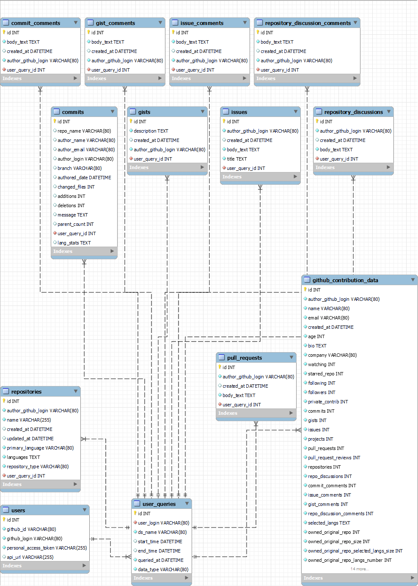

📖 **Documentation Menu**  
🔹 [🏠 Home](index.md)  
🔹 [📥 Installation](installation.md)  
🔹 [🛠 Usage Guide](usage.md)  
🔹 [⚙️ API Documentation](api.md)
🔹 [📓 Database Schema](schema.md)

# 📓 Database Schema

This is the MySQL database schema we use in GitHub-Mole

  