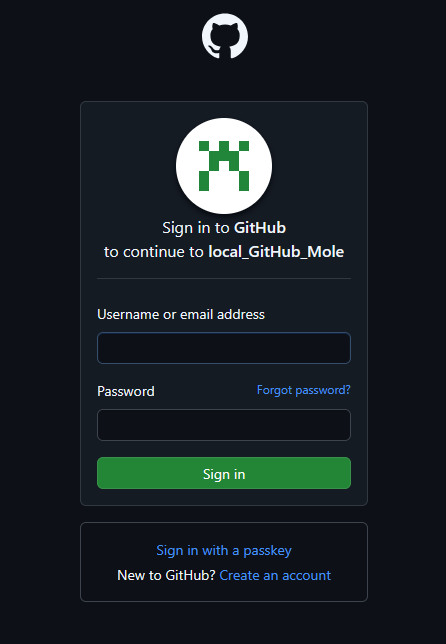
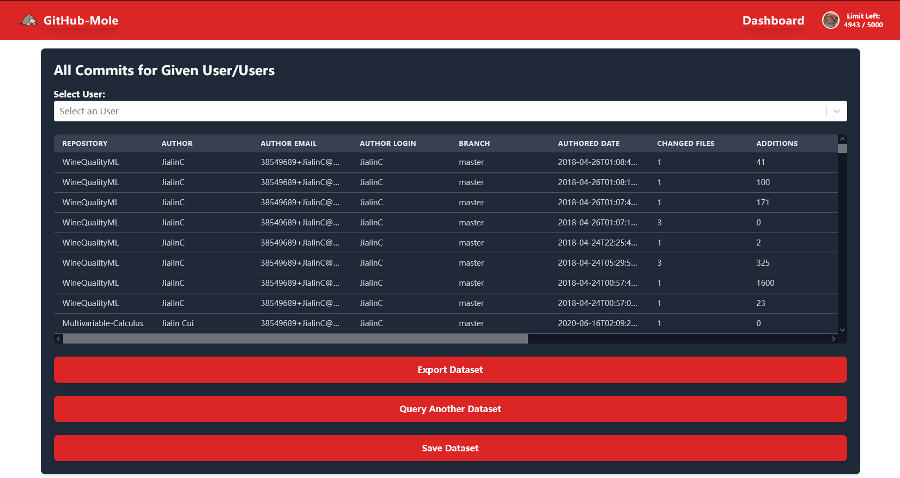

📖 **Documentation Menu**  
🔹 [🏠 Home](index.md)  
🔹 [📥 Installation](installation.md)  
🔹 [🛠 Usage Guide](usage.md)  
🔹 [⚙️ API Documentation](api.md)  

---

# 🛠 Usage Guide  

For a quick overview, watch this YouTube video that demonstrates the functionality of GitHub-Mole: [here](https://youtu.be/3UjDu8ut4ns).  

## Login

Users can log in by providing their GitHub Personal Access Token (PAT). GitHub-Mole does not require a username or password; instead, it authenticates users using their GitHub PAT.  

### Public GitHub Account Login 

Users can use a PAT from their public GitHub account to log in to GitHub-Mole. A public GitHub account PAT will grant users the ability to mine GitHub data hosted on GitHub.com.

  

### Enterprise GitHub Account Login  

Users can also log in via an enterprise GitHub account if they need to access GitHub data hosted on an enterprise server. Many universities and organizations operate their own GitHub Enterprise instances, which are separate from GitHub’s public instance (GitHub.com) and require a different API URL.  

To access data from a GitHub Enterprise instance, users must manually provide their enterprise GitHub URL, as GitHub-Mole cannot automatically determine it. For example, North Carolina State University (NCSU) operates its own GitHub Enterprise instance.  

**Note:** GitHub Enterprise servers impose lower rate limits than the public GitHub instance. For example, NCSU’s GitHub Enterprise instance allows only 200 requests per hour, whereas GitHub.com permits up to 5,000 requests per hour.  

  

### Single Sign-On (SSO) Login  
  
If you prefer not to share your Personal Access Token (PAT) (which, for security reasons, should generally not be shared—though using it for local deployment is acceptable), you can log in to GitHub-Mole using GitHub's Single Sign-On (SSO) feature. For personal deployments, you must configure the GitHub application client key and secret to enable SSO login.

## Dashboard

After logging in, users are directed to the **Dashboard** page, which provides an overview of GitHub activity and access to various features of GitHub-Mole.  

  

The **Dashboard** consists of three main sections:  

- **Red Section:** Displays cumulative GitHub contribution metrics for the logged-in user, along with the remaining API rate limit and the time until the rate limit resets.

- **Yellow Section:** Shows the contribution calendar for the logged-in user. Users can change the displayed year by clicking the year button at the bottom. A darker color on the calendar represents higher contributions on that date. Hovering over a date box reveals the exact contribution count.

- **Green Section:** Provides five action buttons, each corresponding to a different GitHub-Mole functionality:  
  1. **View Mining History Data** – Access previously mined GitHub data.  
  2. **Mine GitHub Contributions** – Retrieve and analyze GitHub contributions.  
  3. **Mine Commits in a Repository** – Extract commit data from a specific repository.  
  4. **Form Development Teams** – Identify potential collaborators based on GitHub activity.  
  5. **Mine All Commits by a User** – Collect commit history for a specific GitHub user.  

## 🔍 Mine GitHub Contributions  

Clicking the **"Mine GitHub Contributions"** button redirects users to the **"Mine User GitHub Contributions"** page.  

GitHub-Mole provides two main functionalities, as shown in the red section of the page.  

### Query the Total Number of GitHub Contributions  

#### List of GitHub Contributions  

Users can query the total number of each type of GitHub contribution for specified GitHub ID(s).  

The complete list of GitHub contributions mined by GitHub-Mole is provided in the following table:  

  
Click to expand the table

  <table>
    <tr>
      <th>Field</th>
      <th>Description</th>
    </tr>
    <tr>
      <td><b>GitHub ID</b></td>
      <td>User's GitHub login, this is also the input.</td>
    </tr>
    <tr>
      <td><b>Name</b></td>
      <td>The user's public profile name.</td>
    </tr>
    <tr>
      <td><b>Email</b></td>
      <td>The user's publicly visible profile email.</td>
    </tr>
    <tr>
      <td><b>Created At</b></td>
      <td>The date and time when the account was created.</td>
    </tr>
    <tr>
      <td><b>Age (days)</b></td>
      <td>The number of days since the account was created until the query date.</td>
    </tr>
    <tr>
      <td><b>Bio</b></td>
      <td>The user's public profile bio.</td>
    </tr>
    <tr>
      <td><b>Company</b></td>
      <td>The user's public profile company.</td>
    </tr>
    <tr>
      <td><b>Watching</b></td>
      <td>The number of repositories the given user is watching.</td>
    </tr>
    <tr>
      <td><b>Starred Repositories</b></td>
      <td>The number of Repositories the user has starred.</td>
    </tr>
    <tr>
      <td><b>Following</b></td>
      <td>The number of users the given user is following.</td>
    </tr>
    <tr>
      <td><b>Followers</b></td>
      <td>The number of users the given user is followed by.</td>
    </tr>
    <tr>
      <td><b>Private Contributions</b></td>
      <td>A count of contributions made by the user that the viewer cannot access. Only non-zero when the user has chosen to share their private contribution counts.</td>
    </tr>
    <tr>
      <td><b>Commits</b></td>
      <td>The number of Commits the given user has created.</td>
    </tr>
    <tr>
      <td><b>Gists</b></td>
      <td>The number of Gists the user has created.</td>
    </tr>
    <tr>
      <td><b>Issues</b></td>
      <td>The number of Issues associated with this user.</td>
    </tr>
    <tr>
      <td><b>Projects</b></td>
      <td>The number of projects under the owner.</td>
    </tr>
    <tr>
      <td><b>Pull Requests</b></td>
      <td>The number of pull requests associated with this user.</td>
    </tr>
    <tr>
      <td><b>Pull Request Reviews</b></td>
      <td>The number of Pull request review contributions made by this user.</td>
    </tr>
    <tr>
      <td><b>Repositories</b></td>
      <td>The number of repositories that the user owns.</td>
    </tr>
    <tr>
      <td><b>Repository Discussions</b></td>
      <td>The number of Discussions this user has started.</td>
    </tr>
    <tr>
      <td><b>Commit Comments</b></td>
      <td>The number of commit comments made by this user.</td>
    </tr>
    <tr>
      <td><b>Issue Comments</b></td>
      <td>The number of issue comments made by this user.</td>
    </tr>
    <tr>
      <td><b>Gist Comments</b></td>
      <td>The number of gist comments made by this user.</td>
    </tr>
    <tr>
      <td><b>Repository Discussion Comments</b></td>
      <td>The number of Discussion comments this user has authored.</td>
    </tr>
    <tr>
      <td><b>Owned Original Repo</b></td>
      <td>The number of repositories that created and owned by the user.</td>
    </tr>
    <tr>
      <td><b>Owned Original Repo Size</b></td>
      <td>The total size in bytes of repositories that created and owned by the user.</td>
    </tr>
    <tr>
      <td><b>Owned Original Repo Selected Langs Size</b></td>
      <td>The total size in bytes of user selected languages in repositories that created and owned by the user.</td>
    </tr>
    <tr>
      <td><b>Owned Original Repo Langs Number</b></td>
      <td>The total number of languages used in repositories that created and owned by the user.</td>
    </tr>
    <tr>
      <td><b>Owned Forked Repo</b></td>
      <td>The number of forked repositories owned by the user.</td>
    </tr>
    <tr>
      <td><b>Owned Forked Repo Size</b></td>
      <td>The total size in bytes of forked repositories owned by the user.</td>
    </tr>
    <tr>
      <td><b>Owned Forked Repo Selected Langs Size</b></td>
      <td>The total size in bytes of user selected languages in forked repositories owned by the user.</td>
    </tr>
    <tr>
      <td><b>Owned Forked Repo Langs Number</b></td>
      <td>The total number of languages used in forked repositories owned by the user.</td>
    </tr>
    <tr>
      <td><b>Collaborating Original Repo</b></td>
      <td>The total number of original repositories in which the user contributes as a collaborator.</td>
    </tr>
    <tr>
      <td><b>Collaborating Original Repo Size</b></td>
      <td>The total size in bytes of original repositories in which the user contributes as a collaborator.</td>
    </tr>
    <tr>
      <td><b>Collaborating Original Repo Selected Langs Size</b></td>
      <td>The total size in bytes of user selected languages in original repositories in which the user contributes as a collaborator.</td>
    </tr>
    <tr>
      <td><b>Collaborating Original Repo Langs Number</b></td>
      <td>The total number of languages used in original repositories in which the user contributes as a collaborator.</td>
    </tr>
    <tr>
      <td><b>Collaborating Forked Repo</b></td>
      <td>The number of forked repositories where the user contributes as a collaborator.</td>
    </tr>
    <tr>
      <td><b>Collaborating Forked Repo Size</b></td>
      <td>The total size in bytes of forked repositories where the user contributes as a collaborator.</td>
    </tr>
    <tr>
      <td><b>Collaborating Forked Repo Selected Langs Size</b></td>
      <td>The total size in bytes of user selected languages in forked repositories where the user contributes as a collaborator.</td>
    </tr>
    <tr>
      <td><b>Collaborating Forked Repo Langs Number</b></td>
      <td>The total number of languages used in forked repositories where the user contributes as a collaborator.</td>
    </tr>
    <tr>
      <td><b>Total Langs Number</b></td>
      <td>The number of languages that the user has used on GitHub.</td>
    </tr>
  </table>

#### Query a Single User  

Users can select **"Only interested in a single user"**, as shown in the yellow section of the image above. GitHub-Mole will then prompt the user to enter a single GitHub ID and proceed with mining.  

By entering a valid GitHub ID, GitHub-Mole will log all types of GitHub contributions made by the specified user from their account creation date to the present (at the time of the query).

#### Selecting Programming Languages of Interest

GitHub-Mole allows users to select the programming languages they are interested in for the specified user(s) as shown in the blue section in the above image. It filters the code size across the user's repositories and logs only the contributions in the selected languages.

#### Selecting a Time Period  

Users can specify a time range for contribution mining, as shown in the green section of the image above. When a time range is provided, GitHub-Mole will log only the contributions made by the specified user(s) within that period, filtering by the `created_at` field of each contribution.  

#### Query Results  

After querying a given GitHub ID, GitHub-Mole presents the results in a table and generates a histogram ranking the selected contributions in descending order, as shown below:   

  

Users can change the contribution type they want to review using the dropdown menu:  

  

After selecting a contribution type, GitHub-Mole updates the histogram to display the relevant data:  

  

#### Export & Save  

GitHub-Mole allows users to export datasets as CSV files, making it easy to conduct further analysis with external tools.  

  

Additionally, GitHub-Mole supports saving mined data to a structured database. This feature is particularly useful for handling large datasets, reducing the need for repeated mining sessions that could take hours.  

  

#### Query Multiple Users  

All functionalities mentioned above also apply when querying multiple GitHub IDs from a file. This makes GitHub-Mole an efficient tool for large-scale data analysis.  

For example, if a user provides a file containing ten valid GitHub IDs, as shown below:  

  

GitHub-Mole will process each ID, log the total contribution data, present the results in a table, and generate a histogram sorted in descending order:  

  

This allows users to analyze contribution trends effectively. For example, users can determine who made the most commits, who contributed the largest code size, or who used the most programming languages within the dataset.  

---

### Query Detailed Information for a Specific Category of GitHub Contributions  

In addition to retrieving total contribution counts, GitHub-Mole supports querying detailed information about specific types of contributions. Instead of logging just the total number, it retrieves metadata about each contribution type.  

The following table lists the currently supported GitHub contribution types and their corresponding fields mined by GitHub-Mole:  

  
Click to expand the table

  <table>
    <tr>
      <th>Contribution Type</th>
      <th>Fields</th>
      <th>Description</th>
    </tr>
    <tr>
      <td rowspan="3"><b>Commit Comments</b></td>
      <td>GitHub ID</td>
      <td>User's GitHub login</td>
    </tr>
    <tr>
      <td>Created At</td>
      <td>The date and time when the comment was created</td>
    </tr>
    <tr>
      <td>Body Text</td>
      <td>The content of the comment</td>
    </tr>
    <tr>
      <td rowspan="3"><b>Gist Comments</b></td>
      <td>GitHub ID</td>
      <td>User's GitHub login</td>
    </tr>
    <tr>
      <td>Created At</td>
      <td>The date and time when the comment was created</td>
    </tr>
    <tr>
      <td>Body Text</td>
      <td>The content of the comment</td>
    </tr>
    <tr>
      <td rowspan="3"><b>Issue Comments</b></td>
      <td>GitHub ID</td>
      <td>User's GitHub login</td>
    </tr>
    <tr>
      <td>Created At</td>
      <td>The date and time when the comment was created</td>
    </tr>
    <tr>
      <td>Body Text</td>
      <td>The content of the comment</td>
    </tr>
    <tr>
      <td rowspan="3"><b>Repository Discussion Comments</b></td>
      <td>GitHub ID</td>
      <td>User's GitHub login</td>
    </tr>
    <tr>
      <td>Created At</td>
      <td>The date and time when the comment was created</td>
    </tr>
    <tr>
      <td>Body Text</td>
      <td>The content of the comment</td>
    </tr>
    <tr>
      <td rowspan="3"><b>Gists</b></td>
      <td>GitHub ID</td>
      <td>User's GitHub login</td>
    </tr>
    <tr>
      <td>Created At</td>
      <td>The date and time when the gist was created</td>
    </tr>
    <tr>
      <td>Description</td>
      <td>The description of the gist</td>
    </tr>
    <tr>
      <td rowspan="4"><b>Issues</b></td>
      <td>GitHub ID</td>
      <td>User's GitHub login</td>
    </tr>
    <tr>
      <td>Created At</td>
      <td>The date and time when the issue was created</td>
    </tr>
    <tr>
      <td>Title</td>
      <td>The title of the issue</td>
    </tr>
    <tr>
      <td>Body Text</td>
      <td>The content of the issue</td>
    </tr>
    <tr>
      <td rowspan="3"><b>Pull Requests</b></td>
      <td>GitHub ID</td>
      <td>User's GitHub login</td>
    </tr>
    <tr>
      <td>Created At</td>
      <td>The date and time when the pull request was created</td>
    </tr>
    <tr>
      <td>Body Text</td>
      <td>The content of the pull request</td>
    </tr>
    <tr>
      <td rowspan="3"><b>Repository Discussions</b></td>
      <td>GitHub ID</td>
      <td>User's GitHub login</td>
    </tr>
    <tr>
      <td>Created At</td>
      <td>The date and time when the discussion was created</td>
    </tr>
    <tr>
      <td>Body Text</td>
      <td>The content of the discussion</td>
    </tr>
    <tr>
      <td rowspan="6"><b>Owned Original Repo</b></td>
      <td>GitHub ID</td>
      <td>User's GitHub login</td>
    </tr>
    <tr>
      <td>Name</td>
      <td>The name of the repository</td>
    </tr>
    <tr>
      <td>Created At</td>
      <td>The date and time when the repository was created</td>
    </tr>
    <tr>
      <td>Updated At</td>
      <td>The date and time when the repository was last updated</td>
    </tr>
    <tr>
      <td>Primary Language</td>
      <td>The main programming language used in the repository</td>
    </tr>
    <tr>
      <td>Language Stats</td>
      <td>Statistics on the languages used in the repository</td>
    </tr>
    <tr>
      <td rowspan="6"><b>Owned Forked Repo</b></td>
      <td>GitHub ID</td>
      <td>User's GitHub login</td>
    </tr>
    <tr>
      <td>Name</td>
      <td>The name of the repository</td>
    </tr>
    <tr>
      <td>Created At</td>
      <td>The date and time when the repository was created</td>
    </tr>
    <tr>
      <td>Updated At</td>
      <td>The date and time when the repository was last updated</td>
    </tr>
    <tr>
      <td>Primary Language</td>
      <td>The main programming language used in the repository</td>
    </tr>
    <tr>
      <td>Language Stats</td>
      <td>Statistics on the languages used in the repository</td>
    </tr>
    <tr>
      <td rowspan="6"><b>Collaborating Original Repo</b></td>
      <td>GitHub ID</td>
      <td>User's GitHub login</td>
    </tr>
    <tr>
      <td>Name</td>
      <td>The name of the repository</td>
    </tr>
    <tr>
      <td>Created At</td>
      <td>The date and time when the repository was created</td>
    </tr>
    <tr>
      <td>Updated At</td>
      <td>The date and time when the repository was last updated</td>
    </tr>
    <tr>
      <td>Primary Language</td>
      <td>The main programming language used in the repository</td>
    </tr>
    <tr>
      <td>Language Stats</td>
      <td>Statistics on the languages used in the repository</td>
    </tr>
    <tr>
      <td rowspan="6"><b>Collaborating Forked Repo</b></td>
      <td>GitHub ID</td>
      <td>User's GitHub login</td>
    </tr>
    <tr>
      <td>Name</td>
      <td>The name of the repository</td>
    </tr>
    <tr>
      <td>Created At</td>
      <td>The date and time when the repository was created</td>
    </tr>
    <tr>
      <td>Updated At</td>
      <td>The date and time when the repository was last updated</td>
    </tr>
    <tr>
      <td>Primary Language</td>
      <td>The main programming language used in the repository</td>
    </tr>
    <tr>
      <td>Language Stats</td>
      <td>Statistics on the languages used in the repository</td>
    </tr>
  </table>

*Note: This list can be expanded by updating the GraphQL query in GitHub-Mole's backend. If you believe certain fields should be included, feel free to open an issue or contribute to the project!*  

If a user selects **"Issues"**, GitHub-Mole logs all issues contributed by the specified users.  

  

As shown above, details such as issue titles and descriptions are recorded. GitHub-Mole also generates a histogram ranking users by the number of issues they have contributed:  

  

The frontend UI of GitHub-Mole is extensible! If you're interested, consider becoming a contributor.  

---

#### Repository Classification & Analysis  

To enhance analysis, GitHub-Mole classifies repositories into four categories:  

1. **Owned Original Repositories** – Repositories created and owned by the user.  
2. **Owned Forked Repositories** – Forked repositories owned by the user.  
3. **Collaborating Original Repositories** – Original repositories where the user contributes as a collaborator.  
4. **Collaborating Forked Repositories** – Forked repositories where the user contributes as a collaborator.  

The GitHub-Mole developer believes that different repository types provide unique insights, so they are processed separately.  

#### Repository Information Query  

When users choose to query repository information, GitHub-Mole logs all repositories that match the selected repository type for each user.  

  

The results are displayed in a table:  

  

Users can select a specific GitHub ID for a detailed view:  

  

They can also choose a specific repository (or all repositories) to analyze:  

GitHub-Mole then renders a histogram showing the code size (in bytes) for each programming language used in the selected repositories. It also generates pie charts illustrating the percentage distribution of languages.  

  

If a user selects a specific repository, GitHub-Mole generates graphs specific to that repository:  

  

Hovering over the language stats reveals detailed size information for each language in bytes:  

  

## 🔍 Mine Commits in a Repository  

Clicking the **"Mine Commits in a Repository"** button redirects users to the **"Mine Commits in a Repository"** page.  

GitHub-Mole provides functionality to mine all commit data from specified repository URLs. The tool offers two main functionalities, as highlighted in the red section of the page.  

Users can choose to perform a **single repository query** or provide a file containing **multiple repository URLs**, as indicated in the yellow section of the page.  

  

---

### Query Commits from the Default Branch for Given Repository(s)  

Users can choose **"Default Branch Only"** to retrieve commit data exclusively from the default branch (e.g., `main` or `master`).  

They can provide either:  
- **A single repository URL** for individual analysis.  
- **A CSV file containing multiple repository URLs** for large-scale data mining.  

This feature is particularly useful in scenarios such as class projects, where an instructor can efficiently obtain contribution data from all students' repositories. By automating the data collection process, GitHub-Mole simplifies tracking and analyzing students' contributions across multiple projects. Users can also export the data or save it to a database for future analysis.  

  

For example, if a user provides a file containing ten valid and existing GitHub repository URLs, as shown below:  

  

GitHub-Mole will retrieve all commit contributions from the **default branch** of the specified repositories.  

The retrieved commit data is displayed in a structured table with the following fields: 

  
Click to expand the table

  <table>
    <tr>
      <th>Field</th>
      <th>Description</th>
    </tr>
    <tr>
      <td><b>Repository</b></td>
      <td>The name of the repository where the commit was made</td>
    </tr>
    <tr>
      <td><b>Author</b></td>
      <td>The name of the commit author</td>
    </tr>
    <tr>
      <td><b>Author Email</b></td>
      <td>The email address associated with the author’s commit</td>
    </tr>
    <tr>
      <td><b>Author Login</b></td>
      <td>The GitHub username of the author</td>
    </tr>
    <tr>
      <td><b>Branch</b></td>
      <td>The branch where the commit was recorded</td>
    </tr>
    <tr>
      <td><b>Authored Date</b></td>
      <td>The date and time when the commit was created</td>
    </tr>
    <tr>
      <td><b>Changed Files</b></td>
      <td>The number of files modified in the commit</td>
    </tr>
    <tr>
      <td><b>Additions</b></td>
      <td>The number of lines added in the commit</td>
    </tr>
    <tr>
      <td><b>Deletions</b></td>
      <td>The number of lines removed in the commit</td>
    </tr>
    <tr>
      <td><b>Message</b></td>
      <td>The commit message describing the changes</td>
    </tr>
    <tr>
      <td><b>Parents</b></td>
      <td>The number of parent commits of the current commit</td>
    </tr>
    <tr>
      <td><b>Languages</b></td>
      <td>The programming languages detected in the commit</td>
    </tr>
  </table>

  

Users can further select a specific repository for a more detailed view:  

  

Since the **default branch only** option was selected, users can only view commits from the default branch:  

  

GitHub-Mole generates a **descendingly sorted histogram** and a **pie chart**, allowing users to quickly identify the most active contributors. These visualizations provide insights into contribution distribution among different users, helping to recognize key contributors based on commit activity.  

  

---

### Query Commits from All Branches for Given Repository(s)  

Users can also choose **"All Branches"** to retrieve commit data from **all branches** of the specified repositories.  

This feature is useful when users are interested in contributions made to branches other than the **default branch**. For example, in collaborative projects, different teams may work on separate branches instead of committing directly to the default branch. This option allows users to analyze commit activity across all branches and gain insights into contributions beyond the main branch.  

  

Users can select a specific **repository** and **branch** to view all contributors within that branch.  

  

  

GitHub-Mole then generates visualizations based on commit data from the selected branch, enabling users to compare contributions across different branches.  

### Data Export & Storage  

All data can be **exported** as CSV files or **saved** to a database for future analysis.

## 🔍Mine All Commits by a User

In certain cases, users may want to query **all commit data** of a specified user across GitHub.  

By default, GitHub only counts commits made to the **default branch** as part of a user's contribution statistics. The table below outlines GitHub’s commit contribution rules:  

  
Click to expand the table

  <table>
    <tr>
      <th>GitHub Contribution Rules</th>
      <th>Criteria</th>
    </tr>
    <tr>
      <td><b>Commits that count toward contributions:</b></td>
      <td>✅ Must be in the default branch or a forked repo with at least one star.</td>
    </tr>
    <tr>
      <td></td>
      <td>✅ The commit must be authored by the user (email must match GitHub account).</td>
    </tr>
    <tr>
      <td></td>
      <td>✅ Must be pushed to GitHub in a public repo or a private repo where the user is a contributor.</td>
    </tr>
    <tr>
      <td><b>Commits that do NOT count:</b></td>
      <td>❌ Commits in non-default branches or unstarred forks.</td>
    </tr>
    <tr>
      <td></td>
      <td>❌ Commits made using an email not associated with GitHub.</td>
    </tr>
    <tr>
      <td></td>
      <td>❌ Commits that are not pushed to GitHub.</td>
    </tr>
  </table>

Unlike GitHub's built-in contribution tracking, **GitHub-Mole allows users to mine commits that do not count toward GitHub statistics**, such as those made to **non-default branches**.  

Clicking the **"Mine All Commits by a User"** button redirects users to the corresponding page.  

GitHub-Mole provides functionality to mine all commit data from specified GitHub IDs. Users can choose between:  
- **Commits to the Default Branch** – Retrieve all commits made by the specified user to the default branch (`main` or `master`) in every repository on GitHub.  
- **Commits to All Branches** – Extend the query to include **all branches** (e.g., feature branches) in every repository, as highlighted in the red section of the page.  

Users can choose to perform a **single-user query** or provide a file containing **multiple GitHub IDs**, as indicated in the yellow section of the page.  

  

---

### Query Commits from the Default Branch for a User  

Users can query **all commits made by a specified user to the default branch** in every repository on GitHub. They must provide either:  
- A **single GitHub ID**  
- A **CSV file containing multiple GitHub IDs**  

  

For example, if a user provides a file containing valid and existing GitHub IDs, as shown below:  

  

GitHub-Mole will mine every commit made by the given user(s) on GitHub to the **default branch** in every repository.  

  

Users can further select a **specific user** for a more detailed view:  

  

Then, they can select a **repository** to inspect:  

  

Finally, they can choose the **branch of interest**. Since only the **default branch** is mined in this case, users can only select the default branch:  

  

GitHub-Mole generates visualizations displaying the **total lines of code added and deleted** in each repository branch:  

  

**Note:** This feature allows users to calculate the **total number of lines of code contributed per programming language**, a statistic **not provided by GitHub**. This metric can offer valuable insights into a user's **technical proficiency and coding impact**.  

---

### Query Commits from All Branches for a User  

If users want to **analyze every commit** made by a specified user on GitHub—including those **ignored by GitHub's built-in statistics**—they can choose to **query all commits made by the given user(s) across all branches** (e.g., main, feature branches, etc.).  

**⚠️ Warning:** This process is **time-consuming** and consumes a **significant number of API rate limits**.  

  

In this example, all commits made by two users across **all branches** are mined. As shown in the previous section, users can select:  
- **A specific user**  
- **A specific repository**  
- **A specific branch**  

  

GitHub-Mole then generates **analytical graphs** for the selected branch, including statistics on **how many lines of code were written in each programming language**:  

  

---

### Data Export & Storage  

All data can be **exported** as CSV files or **saved** to a database for future analysis.  

GitHub-Mole’s ability to log **all commit activity across all branches** makes it an essential tool for researchers, educators, and software teams seeking a **comprehensive understanding of a developer’s contributions**.  

## 🏃🏃 Form Development Teams 🏃🏃  

In addition to GitHub data mining, **GitHub-Mole** provides a **software development team formation** feature.  

Users can start the team formation process by selecting one of the following options, as shown in the **red section** below:  
- **Upload a CSV file containing a custom dataset**  
- **Upload a CSV file containing a list of GitHub IDs**  

  

---

### 📂 Form Teams from a User-Provided Dataset  

Users can upload a file containing selected features (e.g., **GitHub contribution data queried with GitHub-Mole**). GitHub-Mole then applies a **research-backed algorithm** to form teams based on the provided features.  

  

For example, in the following case, the user-provided dataset contains **seven different features**:  

  

GitHub-Mole will **validate the data**, check for **invalid inputs**, and render a visual representation for initial review.  

  

Next, users select the necessary **team formation parameters**, such as **team size** and any constraints. In this example, there are **44 candidates**, and the user specified a **team size of 4**, resulting in **11 teams** of four members each.

  

GitHub-Mole allows users to **export the formed teams**, enabling them to use the assignments later based on their specific needs.  

  

---

### 🆔 Form Teams from Given GitHub IDs  

Users can also provide a list of **GitHub IDs**, allowing GitHub-Mole to **query and analyze GitHub contribution data** for the specified users. Using this data, GitHub-Mole applies the **constrained K-means algorithm** to form teams. [A published research paper](https://dl.acm.org/doi/abs/10.1145/3649217.3653634) demonstrates that this method, when used within GitHub-Mole, results in **better team performance** and **a more uniform performance distribution** compared to traditional team formation methods.  

In the following example, **10 developers** need to be assigned to teams, with a **team size of 3**.  

Users can specify whether teams are **allowed to exceed** the specified size:  
- **If exceeding the team size is allowed**, GitHub-Mole will automatically assign the extra developer to an existing team.  
  - Example: Two teams of size **3** and one team of **4**.  
- **If exceeding the team size is NOT allowed**, GitHub-Mole will list the **leftover developers separately**, allowing the user to decide how to assign them.  

  

GitHub-Mole **aggregates the GitHub contribution data** into predefined features. The details of these features are explained in [A published research paper](https://dl.acm.org/doi/abs/10.1145/3649217.3653634). Before forming teams, GitHub-Mole presents the **visualized data**, providing an **initial overview** of the queried GitHub contributors.  

  

Users can then **select the features** they wish to use for forming **Software Development Teams (SDEs)** by choosing relevant columns in the table.  

Once the selection is submitted, **GitHub-Mole applies the constrained K-means algorithm** to form the teams and displays the results.  

  

In this example, **exceeding the required team size was NOT allowed**, so GitHub-Mole listed the **leftover candidates separately**, along with their assigned cluster. The final decision on assigning these candidates to a team is left to the user.  

  

---

### 🤝 Contribute to GitHub-Mole  

GitHub-Mole is **open to expansion**!  

If you have a **research-backed SDE team formation algorithm** based on **GitHub data**, we encourage you to **become a contributor** and integrate it into the GitHub-Mole platform.  

Your contributions can help improve **data-driven team formation**, making GitHub-Mole even more effective for researchers, educators, and development teams! 🚀  

## 📊 View Mining History Data 📊  

Users can view their **previously saved datasets** by visiting the **"View Mining History Data"** page.  

On this page, users can:  
- **Access, review, and analyze** previously mined data without re-running queries.  
- **Visualize data** using **histograms and pie charts**, making interpretation quick and intuitive.  

  

This feature allows users to efficiently manage their mining results and revisit past analyses without additional API requests.  

---

## ⏰ Rate Limit Handling ⏰  

Since GitHub-Mole automates large-scale GitHub data mining, it must efficiently handle **GitHub’s rate limits**.  

A user's **GitHub Personal Access Token (PAT)** has a limited number of API requests per hour:  
- **5,000 requests per hour** for public GitHub.  
- **Variable limits** for GitHub Enterprise servers.  

At some point, users may **run out of API requests** while querying data.  

🔗 **More information on GitHub API rate limits:**  
- [GitHub REST API Rate Limits](https://docs.github.com/en/rest/using-the-rest-api/rate-limits-for-the-rest-api?apiVersion=2022-11-28)  
- [GitHub GraphQL API Rate Limits](https://docs.github.com/en/graphql/overview/rate-limits-and-node-limits-for-the-graphql-api)  

### ✅ How GitHub-Mole Handles Rate Limits  

GitHub-Mole **gracefully manages rate limit depletion** to ensure uninterrupted data mining.  

- If the rate limit is **exhausted during a query**, GitHub-Mole will:  
  - Display a **progress bar**.  
  - Show a **countdown clock** indicating when the rate limit will reset.  
  - **Automatically resume and complete** any unfinished queries once the limit resets.

  

Theoretically, users only need to specify the data they want to collect, and GitHub-Mole will handle the mining process without further intervention.  

However, extreme cases (such as **network issues** or **GitHub server outages**) may interrupt the query process. To ensure the **best user experience**, we recommend:  
- Querying large datasets in reasonable chunks.  
- Saving results periodically to prevent data loss.  

---

## 🎉 Happy Mining! 😄  
Enjoy using **GitHub-Mole** to explore GitHub contributions, analyze development activity, and form high-performing teams! 🚀  
